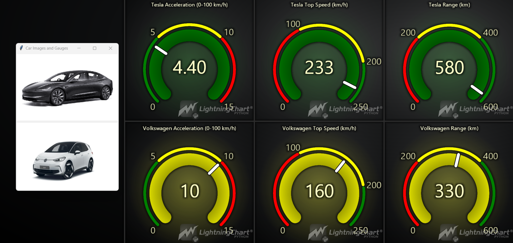
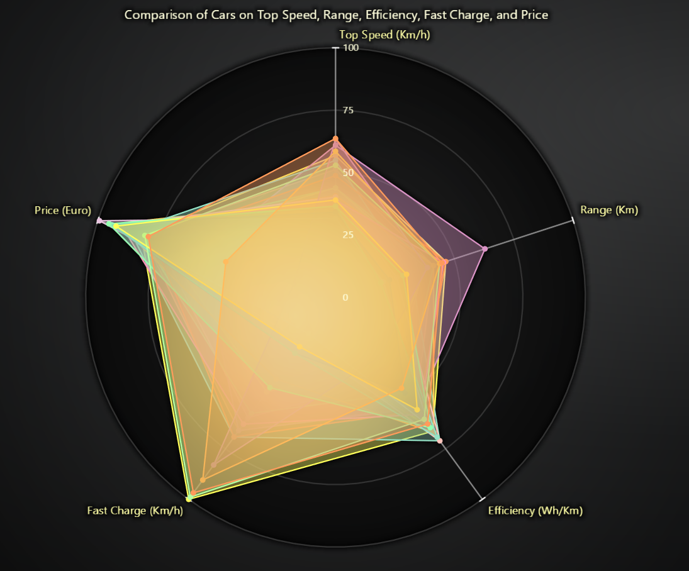
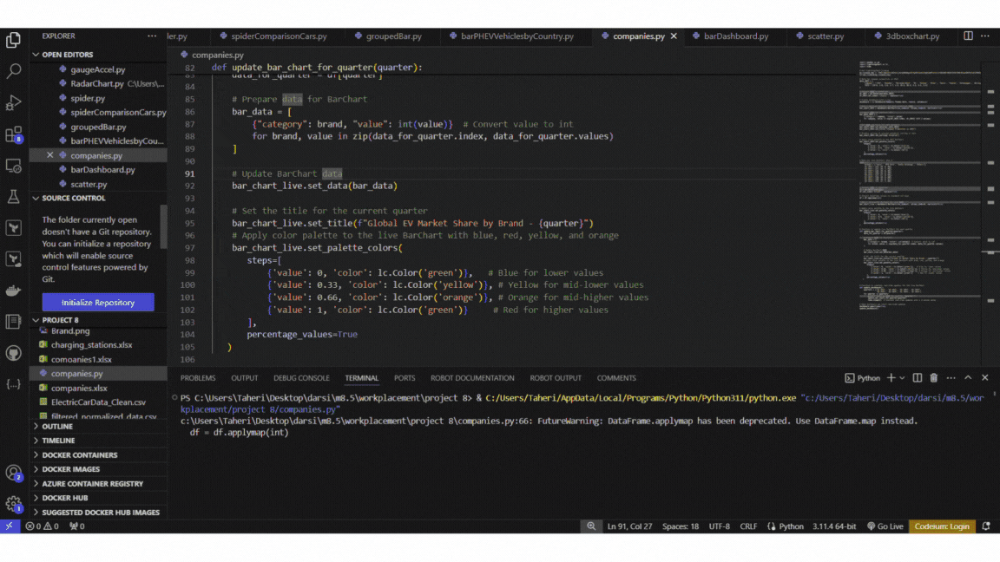
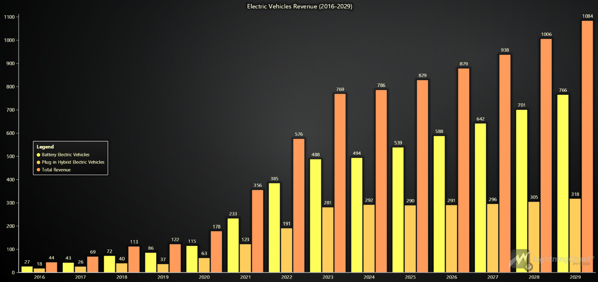

# Electric Vehicles Data Analytics with LightningChart Python
### Introduction
The surge in electric vehicles (EVs) is transforming the global automotive industry and reshaping infrastructure demands. With the increasing penetration of EVs, effective data analytics is crucial to optimize charging infrastructure, track performance metrics, and highlight the environmental benefits of reduced carbon emissions. Electric vehicle data analytics plays a key role in helping industries and governments to make informed decisions about the location of charging stations, peak times for energy consumption, and the environmental impact of EV adoption.
Electric vehicle data analytics involves collecting and analyzing a vast array of data generated from EVs, charging stations, and energy grids. This data can be used to optimize the efficiency of charging networks, predict user behavior, and demonstrate carbon emission reductions. Key metrics like charging frequency, battery health, energy consumption, and geographical usage patterns are essential to understanding EV infrastructure needs. Python, combined with tools like LightningChart, offers a robust platform for visualizing and interpreting this data effectively.
In this article, we will explore how Python, along with LightningChart, can be employed to analyze electric vehicle data to optimize charging infrastructure, monitor key performance metrics, and provide insights into the reduction of carbon emissions.

### LightningChart Python
#### Overview of LightningChart Python
LightningChart Python is a highly performant data visualization library designed for building advanced scientific and industrial charts. It offers an interactive platform for creating a wide range of chart types, from simple line plots to complex 3D visualizations, making it ideal for electric vehicle data analytics. LightningChart stands out due to its ability to handle large datasets with ease, rendering high-speed and high-quality visualizations, which is crucial for managing the scale and variety of data generated by EVs.
#### Performance Characteristics
LightningChart’s ability to handle large datasets at high speed without compromising rendering performance makes it a standout choice for EV data analytics. The efficiency in processing data ensures real-time visual feedback, which is essential when working with dynamic and time-sensitive data, such as energy consumption trends, vehicle movements, or live charging statistics.
### Setting Up Python Environment
#### Installing Python and Necessary Libraries
To get started, you need to have Python installed on your system. You can download Python from the official website. Additionally, you will need to install the following libraries:
```bash
pip install pandas lightningchart
```

#### Overview of Libraries Used
-  *** Pandas: ***  For data manipulation and analysis.
-  *** LightningChart: ***  For creating high-performance visualizations.

#### Setting Up Your Development Environment
You can set up your development environment by using an IDE like PyCharm, Jupyter Notebook, or Visual Studio Code. Simply install the required libraries, import them into your script, and you’ll be ready to start loading and analyzing electric vehicle data.


In this project, various charts from the LightningChart Python library were used to analyze electric vehicle (EV) data across three sections. The analysis focuses on comparing EV performance metrics, tracking global adoption trends by country, and examining the production of major EV manufacturers. The following sections detail the different analyses and visualizations created.

## Section 1: Global Comparison of Electric Vehicles
In the first section, multiple electric vehicles were compared based on various performance metrics, such as acceleration, top speed, and range. A total of four charts were created to visualize this data effectively.

#### Chart 1: Two-Row Dashboard
In this dashboard, two rows are used to compare two electric vehicles from Tesla and Volkswagen.
```bash
# Function to create a gauge chart with a title
def create_gauge(row, column, title, value, value_range, value_indicators):
    chart = dashboard.GaugeChart(row_index=row, column_index=column)
    chart.set_angle_interval(start=225, end=-45)
    chart.set_interval(start=value_range[0], end=value_range[1])
    chart.set_value(value)
    chart.set_value_indicators(value_indicators)
    chart.set_bar_thickness(40)
    chart.set_value_indicator_thickness(10)
    chart.set_title(title)  
# Create Tesla gauges with titles
create_gauge(0, 0, "Tesla Acceleration (0-100 km/h)", tesla_data["AccelSec"], gauge_intervals["AccelSec"], gauge_colors["AccelSec"])
create_gauge(0, 1, "Tesla Top Speed (km/h)", tesla_data["TopSpeed_KmH"], gauge_intervals["TopSpeed_KmH"], gauge_colors["TopSpeed_KmH"])
create_gauge(0, 2, "Tesla Range (km)", tesla_data["Range_Km"], gauge_intervals["Range_Km"], gauge_colors["Range_Km"])
# Create Volkswagen gauges with titles
create_gauge(1, 0, "Volkswagen Acceleration (0-100 km/h)", volkswagen_data["AccelSec"], gauge_intervals["AccelSec"], gauge_colors["AccelSec"])
create_gauge(1, 1, "Volkswagen Top Speed (km/h)", volkswagen_data["TopSpeed_KmH"], gauge_intervals["TopSpeed_KmH"], gauge_colors["TopSpeed_KmH"])
create_gauge(1, 2, "Volkswagen Range (km)", volkswagen_data["Range_Km"], gauge_intervals["Range_Km"], gauge_colors["Range_Km"])
# Open the dashboard
dashboard.open()
```


This dashboard provides a clear visual representation of the performance differences between Tesla and Volkswagen in terms of acceleration, speed, and driving range.

The following code can also be used to add images of vehicles to the chart, enhancing the analytical power and making the chart more visually appealing.
```bash

# Create a Tkinter window for image and LightningChart display
def show_images_and_gauges():
    window = tk.Tk()
    window.title("Car Images and Gauges")

    tesla_img = Image.open("tesla_image.png") 
    volkswagen_img = Image.open("volkswagen_image.png")

    tesla_img = tesla_img.resize((300, 200)) 
    volkswagen_img = volkswagen_img.resize((300, 200))

    tesla_photo = ImageTk.PhotoImage(tesla_img)
    volkswagen_photo = ImageTk.PhotoImage(volkswagen_img)

    tesla_label = tk.Label(window, image=tesla_photo)
    tesla_label.grid(row=0, column=0)

    volkswagen_label = tk.Label(window, image=volkswagen_photo)
    volkswagen_label.grid(row=1, column=0)

    window.mainloop()

if __name__ == '__main__':
    # Run both Tkinter and LightningChart in separate processes
    p1 = multiprocessing.Process(target=create_gauges)
    p2 = multiprocessing.Process(target=show_images_and_gauges)

    p1.start()
    p2.start()

    p1.join()
    p2.join()

```


#### Chart 2: Two-Row Dashboard for Multiple Vehicles
In this chart, a dashboard was created to compare five vehicles: Tesla, Volkswagen, BMW, Mercedes, and Skoda. The first row includes five-gauge charts for acceleration, top speed, and range, while the second row consists of five line charts that show acceleration trends over time for each vehicle.
```bash
def create_live_dashboard():
    # Create a dashboard with 2 rows and 5 columns (one column for each car)
    dashboard = lc.Dashboard(theme=lc.Themes.Dark, rows=2, columns=5)
    # Function to create a gauge chart with a title
    def create_gauge(row, column, title, value, value_range, value_indicators):
        chart = dashboard.GaugeChart(row_index=row, column_index=column)
        chart.set_angle_interval(start=225, end=-45)
        chart.set_interval(start=value_range[0], end=value_range[1])
        chart.set_value(value)
        chart.set_value_indicators(value_indicators)
        chart.set_bar_thickness(40)
        chart.set_value_indicator_thickness(10)
        chart.set_title(title)  # Set title for the chart
        return chart

    # Open the dashboard and start real-time updates
    dashboard.open(live=True)
    update_charts()

# Run the function to create the dashboard
if __name__ == '__main__':
    create_live_dashboard()

```


 This setup enables detailed comparisons of vehicle acceleration.

 #### Chart 3: Spider Chart for Comparing 25 EV Models
 A spider chart was used to compare 25 electric vehicle models across five important performance metrics: TopSpeed_KmH, Range_Km, Efficiency_WhKm, FastCharge_KmH, and PriceEuro.
 ```bash
# Create Radar (Spider) Chart
chart = lc.SpiderChart(
    theme=lc.Themes.Dark,
    title='Comparison of Cars on Top Speed, Range, Efficiency, Fast Charge, and Price'
)
chart.set_web_mode('circle')

for index, row in top_cars.iterrows():
    series = chart.add_series()  
    series.set_name(f"{row['Brand']} {row['Model']}") 
    series.add_points([
        {'axis': 'Top Speed (Km/h)', 'value': row['TopSpeed_KmH']},
        {'axis': 'Range (Km)', 'value': row['Range_Km']},
        {'axis': 'Efficiency (Wh/Km)', 'value': row['Efficiency_WhKm']},
        {'axis': 'Fast Charge (Km/h)', 'value': row['FastCharge_KmH']},
        {'axis': 'Price (Euro)', 'value': row['PriceEuro']},
    ])

chart.open()
 ```
 
 This chart offers a comprehensive comparison of multiple EV models, allowing users to evaluate their strengths in different areas, such as range or efficiency.

 #### Chart 4: 3D Box Chart for Better Comparison of Top Speed, Range, and Price
 A 3D box chart was utilized to compare the top speed, range, and price of various electric vehicles. This visualization highlights key differences between vehicles based on these three criteria.
 ```bash
chart_3d = Chart3D(
    theme=Themes.Dark,
    title='Comparison of Cars on Top Speed, Range, and Price',
    license=my_license_key
)

 ```


This 3D chart allows for a clear comparison of electric vehicles based on speed, range, and price, making it easy to spot outliers or identify trends.

## Section 2: Global EV Adoption by Country
In this section, live bar charts were used to compare electric vehicle adoption rates in different countries from 2011 to 2023. The analysis covers both PHEV (Plug-in Hybrid Electric Vehicles) and BEV (Battery Electric Vehicles), showing global trends over the years.
#### Chart 1: PHEV Vehicles by Country (2011-2023)
A live bar chart was generated to compare the number of PHEV vehicles in countries such as China, Europe, USA, India, Brazil, and others, over the period from 2011 to 2023.
```bash
# Create a pivot table to show the PHEV values for each region by year
pivot_data = filtered_data.pivot_table(index='year', columns='region', values='value', aggfunc='sum').fillna(0)
# Setup the dashboard with 1 row and 1 column
dashboard = lc.Dashboard(theme=lc.Themes.Dark, rows=1, columns=1)
# Create a horizontal Bar Chart for each region
bar_chart = dashboard.BarChart(row_index=0, column_index=0, vertical=False)
# Function to update the chart for each year
# Open the dashboard and start real-time updates
dashboard.open(live=True)
update_dashboard()

```

This chart effectively tracks the growth of PHEV adoption in these countries, highlighting differences and trends in the adoption of hybrid electric vehicles worldwide.

#### Chart 2: Two-Row Dashboard for BEV Vehicles by Country (2011-2023)
A two-row dashboard was created using two live bar charts to compare BEV adoption in the same countries from 2011 to 2023. The first row focuses on a general comparison of PHEV adoption, and the second row compare BEV adoption in the same countries.
```bash
# Setup the dashboard with 2 rows
dashboard = lc.Dashboard(theme=lc.Themes.Dark, rows=2, columns=1)
# Row 1: Bar chart for PHEV vehicles
bar_chart_phev = dashboard.BarChart(row_index=0, column_index=0, vertical=False)
# Row 2: Bar chart for BEV vehicles
bar_chart_bev = dashboard.BarChart(row_index=1, column_index=0, vertical=False)

```


This dashboard helps in understanding the varying levels of BEV and PHEV adoption across different regions, offering insights into where electric vehicle infrastructure may need further development.

## Section 3: Comparison of Electric Vehicle Manufacturers
In the final section, comparisons were made between various electric vehicle manufacturers in terms of production statistics and market share.
#### Dashboard Bar Chart: 
In the dashboard chart below, two rows are used. In the first row, A bar chart was used to compare the production statistics of major manufacturers such as BYD, Hyundai, Mercedes-Benz, MG, Nissan, Tesla, Toyota, Volkswagen, and Wuling for the year 2023. In the second row, A horizontal live bar chart was created to compare the quarterly market share of Tesla, BYD Auto, Geely Holdings, and others from Q3 2022 to Q2 2024.
```bash
# Create dashboard with 2 rows
dashboard = lc.Dashboard(theme=lc.Themes.Dark, rows=2, columns=1)

# Row 1: Vertical BarChart for 2023 production data
bar_chart_2023 = dashboard.BarChart(row_index=0, column_index=0, vertical=True)

# Prepare data for BarChart 2023
bar_data_2023 = [
    {"category": company, "value": value}
    for company, value in zip(df_2023.index, df_2023['2023'].values)
]
bar_chart_live = dashboard.BarChart(row_index=1, column_index=0, vertical=False)
# Function to simulate real-time updates for the live BarChart
def update_dashboard():
    quarters = ['Q3 2022', 'Q4 2022', 'Q1 2023', 'Q2 2023', 
                'Q3 2023', 'Q4 2023', 'Q1 2024', 'Q2 2024']
    for quarter in quarters:
        print(f"Updating data for quarter: {quarter}")
        update_bar_chart_for_quarter(quarter)
        time.sleep(2)  # Simulate real-time updates with a 2-second delay

# Open dashboard and start real-time updates
dashboard.open(live=True)
update_dashboard()
```


#### Grouped bar chart
Finally, a grouped bar chart has been created to forecast the status of electric vehicles based on PHEV and BEV from 2016 to 2029. It is expected that the production rate of BEV electric vehicles will increase, leading to a growing acceptance of electric vehicles at this pace.
```bash
# Create the grouped bar chart
chart = lc.BarChart(
    vertical=True,
    theme=lc.Themes.Dark,
    title='Electric Vehicles Revenue (2016-2029)'
)
chart.set_sorting('disabled')
# Set the data to be grouped by year
chart.set_data_grouped(
    years,
    data
)
# Add a legend and open the chart
chart.add_legend(x=18,y=44).add(chart)
chart.open()

```


The data illustrates significant growth in the production rates of both BEVs and PHEVs, with BEVs experiencing a particularly steep increase over the years. This growth indicates that the acceptance of electric vehicles is likely to rise sharply, reflecting a broader trend towards sustainable transportation solutions. The grouped bar chart provides a clear visualization of these trends, making it easier to analyze and predict future developments in the electric vehicle market.

### Conclusion
In this project, LightningChart in Python was employed to create a diverse array of charts that facilitate a comprehensive analysis and visualization of electric vehicle data. The visualizations encompass gauge charts, spider charts, 3D box charts, and live bar charts, each designed to provide valuable insights into key aspects such as vehicle performance metrics, global adoption trends, and competitive comparisons among manufacturers.
These charts significantly enhance the understanding of the electric vehicle ecosystem, allowing stakeholders—including manufacturers, policymakers, and consumers—to make informed decisions based on accurate data. By visually representing complex data sets, LightningChart not only streamlines the analysis process but also fosters greater engagement with the data.
Furthermore, the adaptability of LightningChart enables users to customize visualizations according to specific needs, ensuring that the most relevant information is presented effectively. This adaptability is crucial in an ever-evolving industry like electric vehicles, where rapid advancements and changing consumer preferences require continuous monitoring and analysis. Overall, the use of electric vehicle data analytics through LightningChart proves to be an invaluable tool for navigating the dynamic landscape of electric mobility, promoting sustainability, and driving innovation in transportation.

### References
- International Energy Agency: [IEA](https://www.iea.org/reports/global-ev-outlook-2024/trends-in-electric-cars)
- Python Official Documentation: [Python](https://www.python.org/)
- LightningChart Documentation: [LightningChart](https://lightningchart.com/python-charts/docs/charts/)
- Our World in Data : [ourworldindata](https://ourworldindata.org/electric-car-sales)
- Global electric vehicle market: [virta](https://www.virta.global/global-electric-vehicle-market)
- Statista : [Statista](https://www.statista.com/outlook/mmo/electric-vehicles/worldwide)